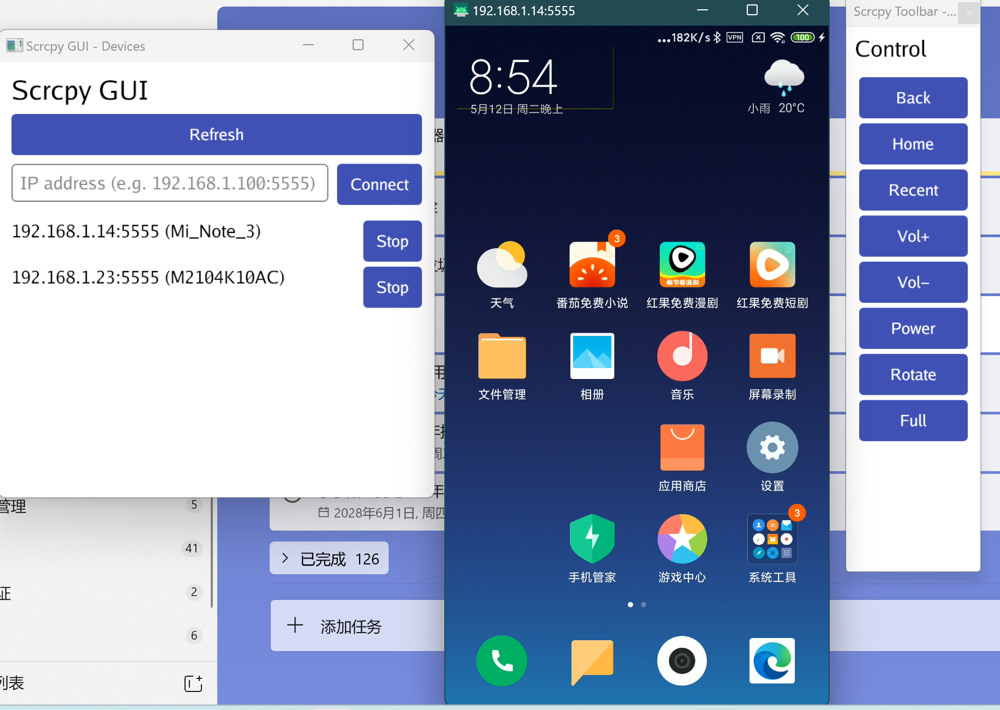

# Scrcpy GUI

[English](README.md) | 中文

一个基于 Gio UI 的 scrcpy 图形界面工具，提供设备管理和悬浮工具栏控制。



## 前置要求

首次启动时，程序会自动检测 **adb** 和 **scrcpy** 是否已安装。如果缺少任一组件，会弹出设置向导提示你从 GitHub Releases 自动下载。

- **Windows** – scrcpy 的发布包通常内置 `adb.exe`，点击“下载 scrcpy”即可同时安装两者。
- **macOS / Linux** – scrcpy 的发布包**不**包含 adb。程序会自动下载 scrcpy，但 adb 仍需单独安装（例如 `brew install android-platform-tools` 或 `apt install android-tools-adb`）。

### 手动安装（可选）

如果你希望自己管理二进制文件，可手动安装后通过 `PATH` 或自定义路径让程序自动识别：

**ADB：** https://developer.android.com/tools/releases/platform-tools  
**scrcpy：** https://github.com/Genymobile/scrcpy/releases

## 使用方法

### 运行程序

```bash
# 直接运行已编译的程序
./scrcpy-gui.exe

# 或者从源码编译运行
go build -ldflags "-H windowsgui" -o scrcpy-gui.exe ./cmd/scrcpy-gui/ 2>&1
./scrcpy-gui.exe
```

### 功能说明

1. **设备列表**：自动显示已连接的 ADB 设备
2. **手动连接**：通过 IP 地址连接远程设备
3. **启动/停止**：为每个设备启动或停止 scrcpy 镜像
4. **悬浮工具栏**：启动 scrcpy 后会自动显示控制工具栏，提供以下功能：
   - Back：返回键
   - Home：主页键
   - Recent：最近应用
   - Vol+/Vol-：音量调节
   - Power：电源键
   - Rotate：旋转屏幕
   - Full：全屏切换

### 行为特性

- 关闭 scrcpy 窗口时，对应的悬浮工具栏会自动关闭
- 工具栏会自动跟随 scrcpy 窗口位置
- scrcpy 最小化时，工具栏也会隐藏

## 从源码编译

```bash
# 克隆项目
git clone https://github.com/zaaack/scrcpy-gui.git
cd scrcpy-gui

# 安装依赖
go mod tidy

# 编译
go build -ldflags "-H windowsgui" -o scrcpy-gui.exe ./cmd/scrcpy-gui/ 2>&1
```

## 常见问题

### 首次启动提示“未检测到 adb / scrcpy”
在设置向导中点击**下载 scrcpy**，程序会自动从 GitHub Releases 获取最新版本。
- Windows 用户通常可以同时获得 scrcpy 和 adb。
- macOS / Linux 用户仍需单独安装 adb，因为 scrcpy 的发布包中不包含 adb。

如果自动下载失败（如网络问题），可参考[前置要求](#前置要求)中的**手动安装**步骤。

### 设备未显示
1. 确保设备已开启 USB 调试
2. 运行 `adb devices` 确认设备已连接
3. 点击"Refresh"按钮刷新设备列表

## 许可证

MIT License
